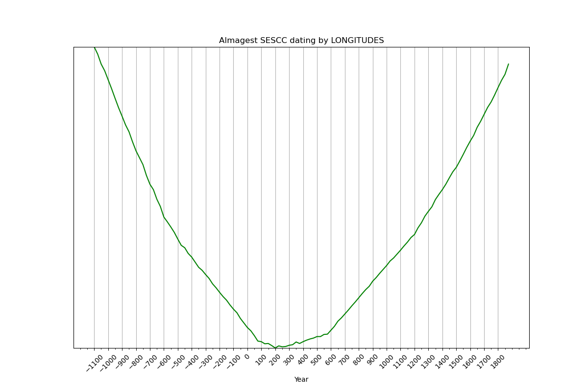

_v20240515: Added option to date by random group of stars (more info below)_

# sescc
## **Speed/Error Signal Cross Correlation and Shared Reference in Delta Geminorum** ##
(sescc for short)

2024 Carlos Baiget Orts (cjbaiget)
asinfreedom@gmail.com

## **sescc** aims to settle ONCE AND FOREVER the EXACT <ins>astronomical dating</ins> of Ptolemy's Almagest

sescc is a **generic method** for dating stellar catalogs compiled in ecliptical coordinates.

sescc is the **first and only method** to find the date of catalog by the speed/error correlation of the stars and uses an static star for frame reference.

sescc provides:

+ reliably dating the Almagest by latitudes **or LONGITUDES.**
+ reliably dating the Almagest by **arbitrary groups of TENS to HUNDREDS of its stars.**
+ PROOF that the Almagest's **LONGITUDES were not COMPUTED, but MEASURED** by Ptolemy himself in 2nd cy.
+ PROOF that the Almagest's **LATITUDES were measured by Hipparchus** himself in -2nd cy.
+ PROOF that the Almagest includes **later corrections by al-Battani (9 cy) and Regiomontanus (15 cy)**
+ PROOF that Fomenko,Kalashnikov & Nosovsky's method(1) that points to the medieval period is **HOPELESSLY FLAWED, IF NOT FRAUDULENT**. As well as the reason (more info below).
+ PROOF of **scientific activities** in -2nd cy B.C. Meaning: knowledge of writing, fractional counting, astronomical reference systems, documentary repositories, a great deal **BEFORE** the 11th century.

## Related research / background:

+ Dating the Almagest star catalogue using proper motions: a reconsideration (https://people.sc.fsu.edu/~dduke/pmotion.pdf)
+ On the Origin of the Ptolemaic Star Catalogue, parts 1 & 2 (https://adsabs.harvard.edu/full/1987JHA....18..155E) (https://adsabs.harvard.edu/full/1987JHA....18..233E)
+ The enigma of Ptolemy's catalogue of stars (https://adsabs.harvard.edu/full/1992JHA....23..173S)
+ The dating of Ptolemy's Star Catalogue (https://adsabs.harvard.edu/full/2002JHA....33..265D)
+ Dating Ptolemy's star catalogue through proper motions: the Hipparchan epoch (https://adsabs.harvard.edu/full/2000JHA....31..115D)
+ Declinations int the Almagest: accuracy, epoch, and observers (https://www.narit.or.th/files/JAHH/2014JAHHvol17/2014JAHH...17..326B.pdf)
+ (1) Geometrical and statistical methods of analysis of star configurations : dating Ptolemy's Almagest (https://library.navoiy-uni.uz/files/fomenko%20a.%20t.,%20kalashnikov%20v.%20v.,%20nosovsky%20g.%20v.%20-%20geometrical%20and%20statistical%20methods%20of%20analysis%20of%20star%20configurations%20(2000)(300s).pdf)
+ The New Chronology of Fomenko and Nosovskyi ends today (=2024/4/15) (https://forum.chronologia.org/viewtopic.php?t=901)

## sescc description / usage:

**WARNING: This program downloads 1.7Gb of ephemeris from NASA in its first run.** 
more info: https://rhodesmill.org/skyfield/planets.html

**sescc was made to astronomically date Ptolemy's Almagest.** 

This is the sescc dating program, you can use it to **SCIENTIFICALLY PROVE** that the Ptolemy's Almagest was initially compiled by Hipparchus and Ptolemy in the -2nd and 2nd century C.E.

sescc can reliably date the Almagest by latitudes or longitudes, as well as any other catalog compiled in ecliptic coordinates, between -1500 and 1900 C.E.

This program requires Python, Skyfield, Numpy and Panda libraries:

+ https://www.python.org/
+ https://rhodesmill.org/skyfield/
+ https://numpy.org/
+ https://pandas.pydata.org/

**What on earth is "Speed / Error Signal Cross Correlation"?**

Will explain with more detail soon.
Briefly: 

1. The working set is a list of stars. Each of those stars has proper motion. The **list of speeds** is a discrete signal, the 'speed signal' A:


Fig 1. Example of the speed signal A of a catalog.
   
2. For every epoch t, the difference of the stars positions in the catalog and the computed positions for that epoch defines a **list of errors**, that is the 'error signal' B(t).


Fig 2. Example of the set of errors signals B(t) of a catalog. Each color is the error signal associated with a candidate epoch t.

3. But the speed of a star CANNOT be a source of its error in the catalog!

Therefore:

When a **signal cross correlation** between A and B(t) appears is **necessarily** due to B being computed for a **wrong epoch t**.

Meaning: **date of the catalog is the date the minimal cross correlation.**

**What on earth is "Shared reference in Delta Geminorum?"**

1. We just don't know how accurate was the ancient astronomer determination of the (0,0) coordinate.
2. We could use an almost static star near the ecliptic as a *shared reference* between the ancient astronomer and us, to **match** the ancient catalog with each of our computed ones.
3. This star exists and was compiled in the catalog! It's _Delta Geminorum_ with a combined proper motion of only 18 mas/year.

This shared reference is what allows dating the Almagest by longitudes.

## some results:




## sescc.py:

**Basic usage in LINUX:**

### 0. Install libraries:

`pip install pandas skyfield numpy`
 
### 1.Date Almagest by latitudes:

`./sescc.py < catalogs/almagest.csv`

(Load generated .csv file to spreadsheet, then graph a dispersion plot with the data.)

### 2.Date Almagest by longitudes:

`./sescc.py 1 < catalogs/almagest.csv`

### 3.Date ("New Chronology"=NC) Fomenko, Kalashnikov, Nosovsky's 'informative kernel' by latitudes (use `./sescc.py 1` for longitudes):

`./sescc.py < catalogs/fkn_kernel.csv`

### 4.Date NC 'informative kernel' without Arcturus by latitudes (`./sescc.py 1` for longitudes):

`./sescc.py < catalogs/fkn_wo_arcturus.csv`

### 5.Dating based on a random group of stars:

In the default setting, sescc will discard stars with mag>2.5 (brighter stars were measured first).
This results in a set of 91 stars for dating the catalog.
You may wonder if (as is the case with FKN method), the dating relies on a **single star** (see below).
A set of 91 stars results in **2*10²⁴ combinations of 70 stars**. To date the catalog based on a random combination, you can use the following command.
A few executions are enough to verify the typical outcome.

`./sescc.py 0 70 < catalogs/almagest.csv`

To expand de working set, set a higher magnitude. Maxmag = 3 gives a working set of 157 stars.
So to date the catalog from one of its **2*10⁴¹ combinations of 50 stars** you can use this command:

`./sescc.py 0 50 3 < catalogs/almagest.csv`

## Remarks regarding "New Chronology's informative kernel"

"NC's informative kernel" is the **WORST** set of stars to date the Almagest. It consists of a **selection of stars that will give a medieval date.**
Those stars where updated by later astronomers, Battani in 9th Cy, Regiomontanus in 15 cy.

Dissection of "New Chronology's" "informative kernel":

+ Procyon, Capella: Regiomontanus (15th century)
+ Arcturus: Al-Battani (9th century)
+ Regulus, Spica, Vega, Antares, Asellus: Hipparchus (-2nd century)

Fomenko, Kalashnikov, Nosovsky's dating is dominated by Arcturus due its much higher relative proper motion:


"informative kernel" w/o Arcturus is dominated by Regiomontanus stars:


That's how they achieved a 10th Century date.

If this error is not admitted, it's just **scientific fraud in plain sight.**

If admitted, an honest explanation be explored:

NC's selection criteria looking for **bright and quick** stars **had an implicit and lethal risk**: that precisely those were most carefully tracked by later astronomers who of course **noticed the error and updated the catalog.**

Results indicate that this is what happened with al-Battani, who updated Arcturus in the 9th century, and Regiomontanus, who updated Procyon and Capella in the 15th.
Those updates made their way into the canonical edition of the Almagest in the 15th century, by none other than Regiomontanus.
Later researchers thought erroneously that the whole catalog was from Ptolemy. Detected incosistencies, attributed him a fraud. 

However, the main result of SESCC is that **Star positions and established chronology of the Almagest are fully coherent.**

Clarifications:
+ **Any other consideration** about **any other information** within the Almagest **requires a separate analysis.**
+ SESCC results **do not contradict the conclusions of the book "The Crime of Claudius Ptolemy"** from R.R. Newton (1977). In fact, its a corroboration of one of the main points in it: that it contains original work from Hipparchus.
+ As SESCC shows, this part is precisely the LATITUDES part of almost all the star positions.


**Syntax for WINDOWS:**

### 0. Install python, after that, libraries like in linux (step 0)

### 1.Date Almagest by latitudes:

`python sescc.py < catalogs/almagest.csv`

### 2.Date Almagest by longitudes:

`python sescc.py 1 < catalogs/almagest.csv`

etc...

## stella.py:

Creates a catalog for any epoch, list of stars is taken from another catalog, example:

`cat catalogs/fkn_kernel.csv | ./stella.py 1100 10 0 0 | ./sescc.py`

This takes the list of stars detailed in 'fkn_kernel.csv' and creates a new catalog for year 1100, with 10' resolution (using the fractional system of the Almagest), with 0' of systemical error and 0' of random error.

You can feed the output to sescc.py to verify it works as expected. stella.py can also be used to prove that sescc.py doesn't date the longitudes by their magnitude. Magnitudes can be adjusted for the axial precession of any other epoch and the results will be the same.

An example of this modification is the catalog 'almagest_fake_longs.csv' where **longitudes are increased by 15º, not affecting the dating of the catalog by longitudes**:

`./sescc.py 1 < catalogs/almagest_fake_longs.csv`

gives the same dating as:

`./sescc.py 1 < catalogs/almagest.csv`


```
$ tail -n5 catalogs/almagest_fake_longs.csv
105382;-22.17;281.17
106327;-21.17;284.0
105696;-20.83;282.0
102831;-17.0;283.83
103738;-14.83;283.83

$ tail -n5 catalogs/almagest_fake_longs.csv
105382;-22.17;296.17
106327;-21.17;299.0
105696;-20.83;297.0
102831;-17.0;298.83
103738;-14.83;298.83
```

## catalogs:

Format:
star_HIPPARCOS_ code ; latitude ; longitude

'0;' before star code means a reject, which will be ignored when loading catalog

There are just three rejects:

HIP71683 - Rigil Kentaurus

HIP69673 - Arcturus

HIP97649 - Altair

You can explore the effect of uncommenting those lines in the result.

First line **must** be HIP35550 (Delta Geminorum), which is a surrogate of the equinox as the reference point for any epoch, rather than the one employed by the computer, which may differ from that of the ancient astronomer.

*************************************************************************************************************
